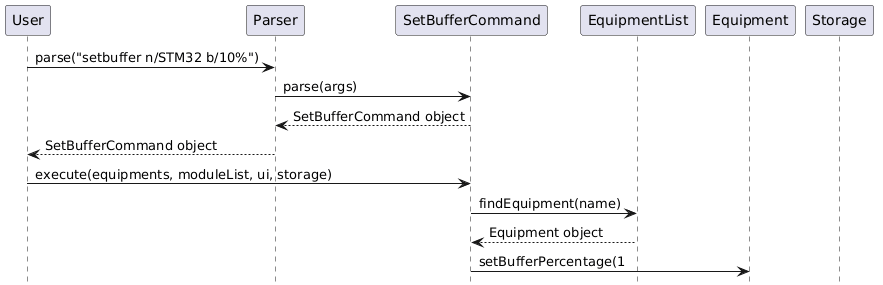
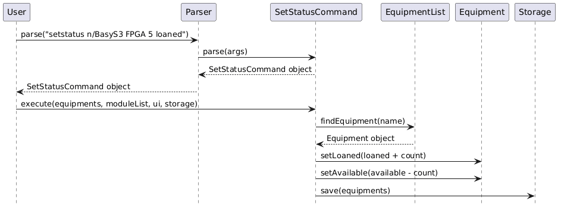

# Developer Guide

## Acknowledgements

{list here sources of all reused/adapted ideas, code, documentation, and third-party libraries -- include links to the original source as well}

## Design & implementation

### SetBufferCommand

Sets a buffer percentage on a named equipment item. The buffer is persisted to storage.



**Format:** `setbuffer n/<name> b/<percentage>[%]`

**Behaviour:**
- The `%` symbol in the buffer value is optional and stripped during parsing
- If the equipment name is not found, an error message is shown and no change is made
- Buffer percentage defaults to `0.0` when equipment is first added

**Example:**
```
setbuffer n/STM32 b/10%
setbuffer n/STM32 b/10
```
 
---

### SetStatusCommand

Updates the loaned or available count of an equipment item. Can target equipment by name or by 1-based index.



**Format:**
- `setstatus n/<name> <count> loaned` — loans out `<count>` units, decreasing available
- `setstatus n/<name> <count> available` — returns `<count>` units, increasing available
- `setstatus <index> <count> loaned/available` — same as above but targets by 1-based list index

**Constraints:**
- Negative counts are rejected silently — no change is made
- Count must not exceed current available (when loaning) or current loaned (when returning)

**Example:**
```
setstatus n/BasyS3 FPGA 5 loaned
setstatus 1 3 available
```

## Product scope
### Target user profile

{Describe the target user profile}

### Value proposition

**Equipment Master** is a fast, text-based desktop application designed to digitize and streamline laboratory inventory management. Built specifically for university lab technicians managing high-traffic innovation spaces, it replaces fragile, error-prone paper logs with a secure, highly accountable digital system.

Whether you are managing shared pools of STM32 boards across different modules (e.g., EE2028, CG2028), allocating Basys3 boards for EE2026, or tracking general accessories like HDMI cables, Equipment Master ensures you always know exactly what you have and who has it.

**Why use Equipment Master?**
* **Ditch the Paper:** Transition from disorganized physical folders to a searchable, secure digital ledger.
* **Rapid CLI Workflow:** Designed for fast typists. Log check-outs and returns in seconds using simple text commands, avoiding clunky GUI menus.
* **Module-Specific Tracking:** Easily associate equipment with specific academic modules to track usage and allocations accurately.
* **100% Accountability:** Precisely track borrower identities and monitor equipment availability to eliminate the loss of high-value lab assets.

## User Stories

|Version| As a ... | I want to ... | So that I can ...|
|--------|----------|---------------|------------------|
|v1.0|new user|see usage instructions|refer to them when I forget how to use the application|
|v2.0|user|find a to-do item by name|locate a to-do without having to go through the entire list|

## Non-Functional Requirements

{Give non-functional requirements}

## Glossary

* *glossary item* - Definition

## Instructions for manual testing

{Give instructions on how to do a manual product testing e.g., how to load sample data to be used for testing}
